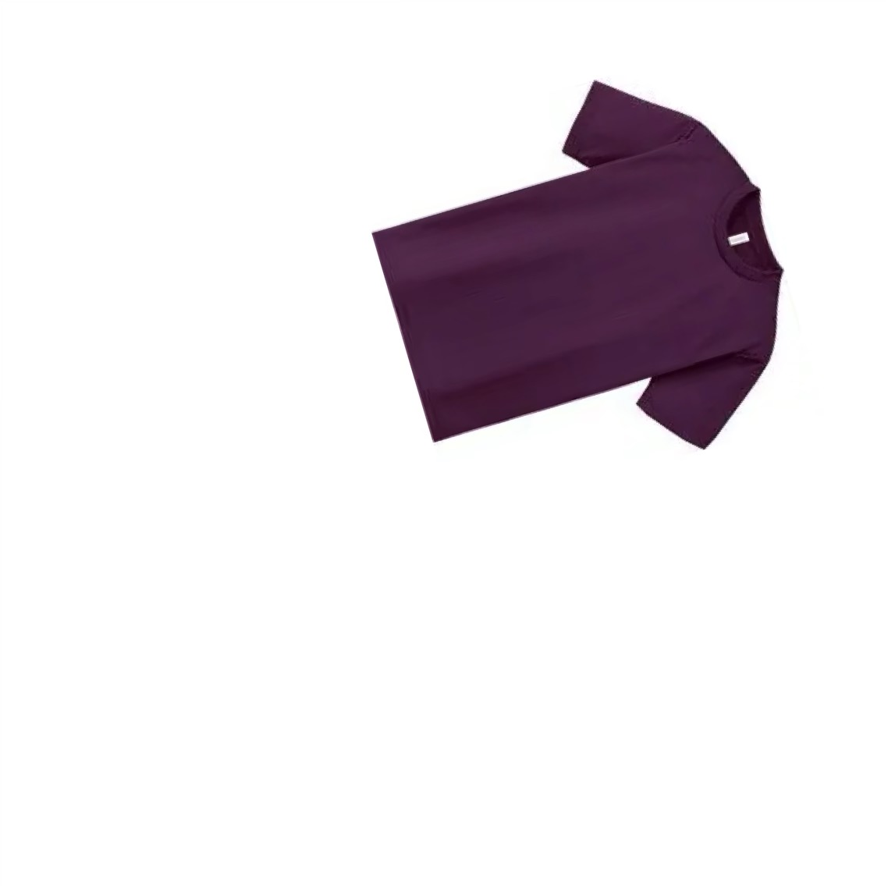
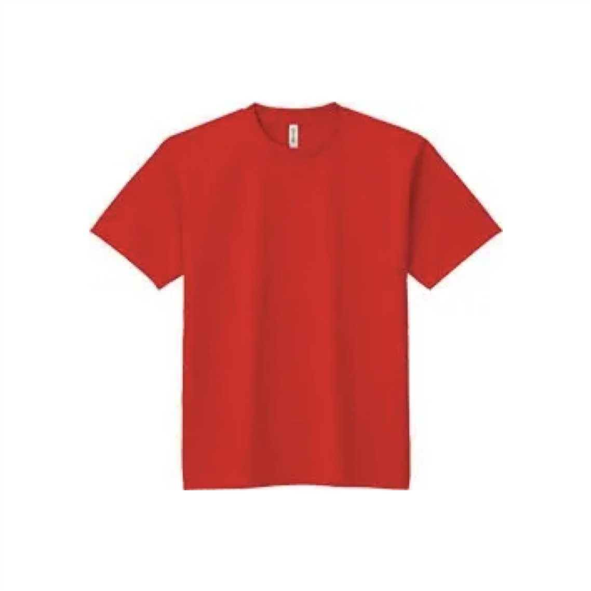
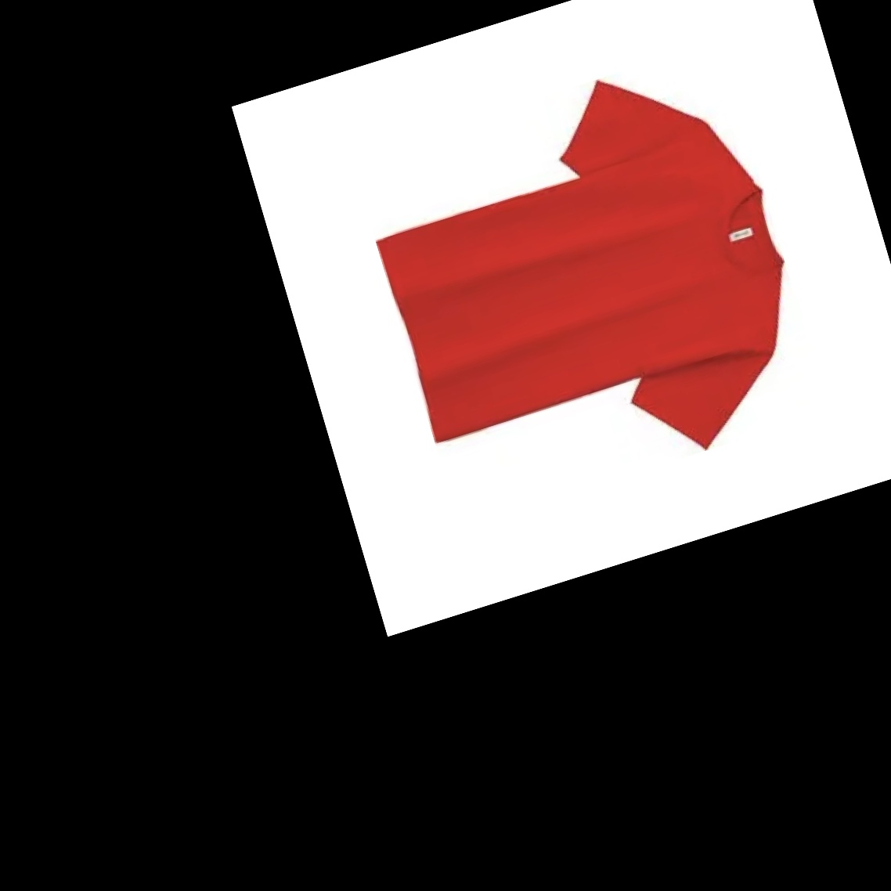

# 特徴点に基づく類似画像のアフィン変換

似たような物体が映った画像`a.jpg`と`b.jpg`がある。

`a.jpg`が見本で、



`b.jpg`をこれと同じような配置にしたい。



OpenCVで両者の特徴点が近傍する変換行列を求め、アフィン変換する。



背景処理に問題が残るが、期待する変換ができた。

## 再現

Node.jsを用いる。`opencv2nodejs`をビルドするためOpenCVのライブラリ(`libopencv-dev`など)が必要。

```bash
yarn
# 結果を削除
rm aligned-b.jpg
node index.js
```

## Python版

試していないが、`python-example.py`に同様のプログラムを示した。
